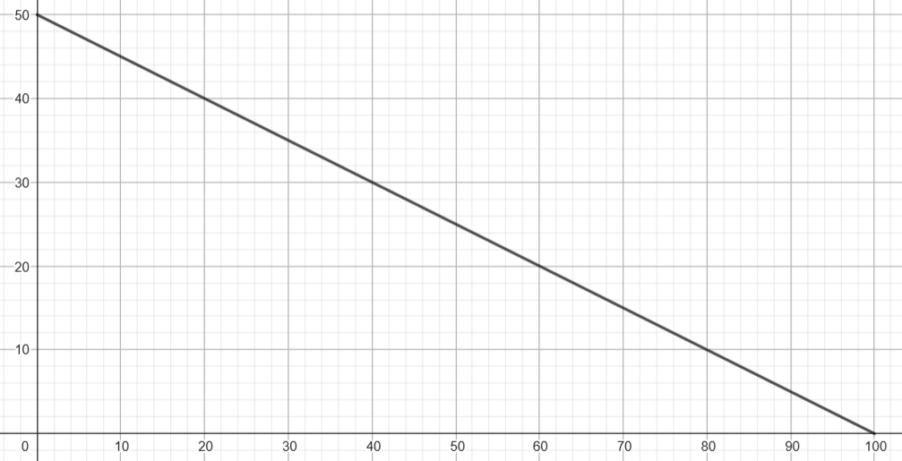
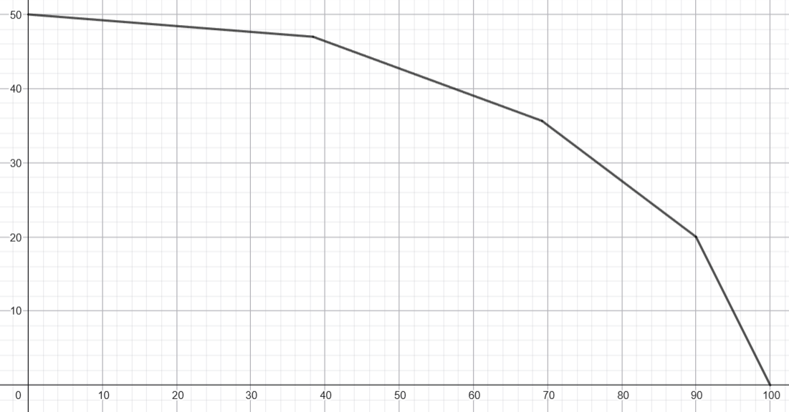
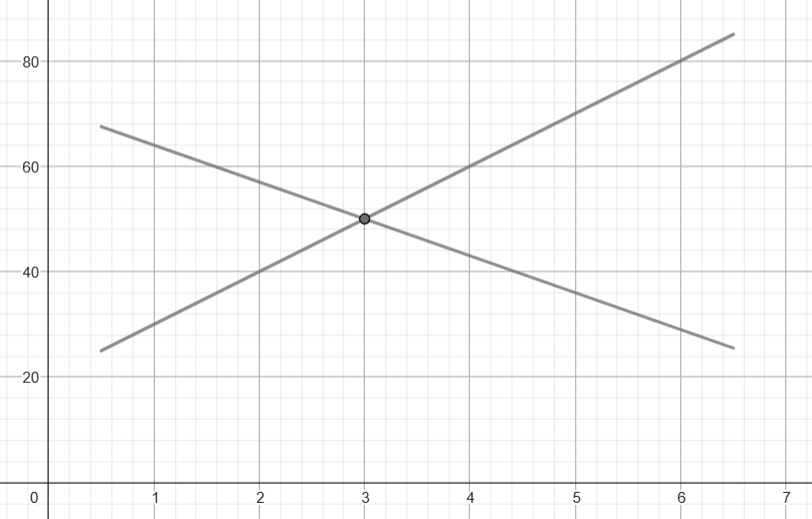
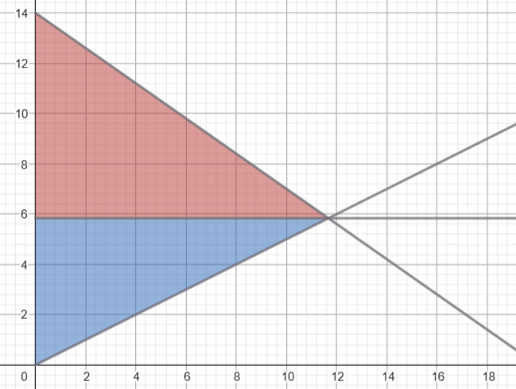

# Some Econ Things

Here are some economics things I've learned, in no particular order.

This page is not remotely exhaustive of the field.

## Production--possibility frontier

Andy runs a bakery. Or at least, he owns several robots that produce baked goods. Each robot can use up to $100$ units of energy per day, the cost of which we will ignore.

Andy's menu is simple: he only sells apple pies and brownies. For the $i$-th robot, he knows that:

- If it uses **all** its energy on making apple pies, it will produce $a_i$ of them;
- If it uses **all** its energy on making brownies, it will produce $b_i$ of them.

How can Andy allocate his robots efficiently?

### One robot

Let's start simple and assume Andy only has $1$ robot. Say $a_1 = 100$ and $b_1 = 50$.

If the robot only makes apple pies, then it produces $100$ apple pies and $0$ brownies a day. We'll represent this as the point $(100, 0)$. If the robot only makes brownies, then it produces $0$ apple pies and $50$ brownies a day, which we'll represent as $(0, 50)$.

Of course, these are not the only two possibilities. For example, the robot can use $50$ units of energy for apple pies and $50$ units of energy for brownies. Then it produces $50$ apple pies and $25$ brownies a day, which we'll represent as $(50, 25)$. Here we're assuming that energy consumption is linearly proportional to the production of baked goods; let's not give ourselves a headache.

We can see that, if the robot uses all its energy, the set of all possibilities is represented by a straight line connecting $(0, 50)$ and $(100, 0)$. Naturally, its slope is negative; specifically it's $-\frac{1}{2}$.

{style="width:70%;"}

This line is called the **production--possibility frontier**, or PPF for short.

Here's a nice interpretation: the robot starts out at $0$ apple pies and $50$ brownies, and it can then "convert" $\frac{1}{2}$ brownie into $1$ apple pie until there are no more brownies left. Conversely, if the robot starts out at $100$ apple pies and $0$ brownies, it can convert $2$ apple pies into $1$ brownie until there are no more apple pies left.

These trade-offs are also known as the **opportunity cost**. The opportunity cost of $1$ apple pie is $\frac{1}{2}$ brownie, and the opportunity cost of $1$ brownie is $2$ apple pies. They are reciprocals of each other, because that's how math works.

Now, it's possible that the robot doesn't use up all its energy. For instance, if the robot uses $20$ units of energy for apple pies and $20$ units of energy for brownies, then it produces $20$ apple pies and $10$ brownies, which is the point $(20, 10)$. Unsurprisingly, this point lies **below** the PPF. This is clearly not **efficient** for Andy, assuming he only cares about producing baked goods. So from here, we'll just care about points that lie on the PPF.

### Many robots

When there are multiple robots, it gets interesting, because not all robots are equally "good" at producing apple pies and brownies, for some notion of "good" we'll define shortly.

If Andy only cared about producing apple pies, then this is easy: the robots can produce $a_1 + a_2 + \ldots + a_n$ apple pies a day. Similarly, if Andy only cared about producing brownies, then the robots can produce $b_1 + b_2 + \ldots + b_n$ brownies a day.

But what happens in the middle? Using our conversion idea from earlier, to convert $b_1 + b_2 + \ldots + b_n$ brownies into $a_1 + a_2 + \ldots + a_n$ apple pies, each robot itself should gradually shift its production from brownies to apple pies. Specifically, the $i$-th robot gradually converts $b_i$ brownies into $a_i$ apple pies.

To maximize efficiency, Andy should greedily order the robots by increasing $\frac{b_i}{a_i}$. The robot with the lowest $\frac{b_i}{a_i}$ converts all its brownies to apple pies, then the next robot does the same, and so on, until all robots have finished their conversion.

Coming back to English, robots with a lower $\frac{b_i}{a_i}$ are "better" at producing apple pies relative to brownies, so Andy should allocate them on apple pie duty first. To introduce some terminology, these robots have a **comparative advantage** in producing apple pies over other robots.

On the other hand, robots with a higher $\frac{b_i}{a_i}$ are "worse" at producing apple pies relative to brownies, so Andy should only let them produce apple pies as a last resort, when he's run out of good apple pie producers. These robots instead have a comparative advantage in producing brownies.

{style="width:70%;"}

This causes the PPF to become **concave**: starting from the curve's $y$-intercept, each segment's slope decreases until it reaches the $x$-intercept. In more realistic models, you wouldn't necessarily have discrete segments like this; it'd just be a smooth continuous curve.

It's worth noting that, if all the robots had the same $\frac{b_i}{a_i}$, then the PPF degenerates into a straight line as before. This is not to say that all robots perform equally well. It's just that none of them have a comparative advantage. It's entirely possible for one robot to produce more apple pies or brownies using the same amount of energy; this is called an **absolute advantage**.

## Trading

Andy's boyfriend Benny also runs a bakery just across the road. They haven't merged yet, since they (sensibly) want to keep their relationship low-key for the time being.

We'll assume a linear PPF for both Andy and Benny. Again, if Andy's robots used all their energy on apple pies, they'd produce $100$ apple pies a day. If they used all their energy on brownies, they'd produce $50$ brownies a day. The corresponding numbers for Benny are $75$ apple pies and $45$ brownies a day. The boys just *really* like apple pies and brownies, don't worry about it.

Let's put everything in a table:

|            | Andy             | Benny           |
| :--------- | :--------------- | :-------------- |
| Apple pies | $100$ apple pies | $75$ apple pies |
| Brownies   | $50$ brownies    | $45$ brownies   |

If Andy and Benny never interacted with each other and lived **in autarky**, then they could only ever hope to produce as efficiently as constrained by their respective PPFs. However, with the power of ~~love~~ trading, they can obtain consumption combinations outside their PPFs.

Let's now consider Andy's and Benny's respective opportunity costs:

|            | Andy                   | Benny                    |
| :--------- | :--------------------- | :----------------------- |
| Apple pies | $\frac{1}{2}$ brownie  | $\frac{3}{5}$ brownie    |
| Brownies   | $2$ apple pies         | $\frac{5}{3}$ apple pies |

Notice that Andy has a comparative advantage in producing apple pies, since it costs fewer brownies per apple pie. Conversely, Benny has a comparative advantage in producing brownies, since it costs fewer apple pies per brownie.

With two goods and linear PPFs, one of them should have a comparative advantage in one thing, and the other one should have a comparative advantage in the other thing. Again, that's how math works. The only exception to this is when neither has a comparative advantage over anything, but then trading wouldn't be useful anyway.

Coming back to this example, since Andy has the comparative advantage in producing apple pies, he decides to focus on **only** producing apple pies. Similarly, Benny decides to focus on **only** producing brownies.

Andy and Benny meet up at the nearest café, baked goods in hand. Andy offers $18$ apple pies, and Benny offers $10$ brownies. Is this a reasonable trade?

Well, the price of a trade can be expressed two ways: both from the perspective of Andy, and from the perspective of Benny. For Andy, he's converting $18$ apple pies into $10$ brownies, so the price of this trade is $\frac{9}{5}$ apple pies per $1$ brownie. This is less than if he had just used his robots to convert $2$ apple pies into $1$ brownie, so he's happy.

For Benny, it's basically the same thing. He's converting $10$ brownies into $18$ apple pies, so the price of this trade is $\frac{5}{9}$ brownies per $1$ apple pie. This is less than if he had just used his robots to convert $\frac{3}{5}$ brownies into $1$ apple pie, so he's also happy.

Mathematically, if the price of $1$ apple pie is between $\frac{1}{2}$ and $\frac{3}{5}$ brownie, then both sides are happy. Similarly, if the price of $1$ brownie is between $\frac{5}{3}$ and $2$ apple pies, then both sides are happy. In the end, both boys have achieved a consumption combination outside their respective PPFs.

Note that Andy has an absolute advantage over Benny in both apple pies and brownies (Benny gets teased relentlessly over this). However, it is ultimately still worth it for both sides to trade.

## Market price

Of course, no bakery is without customers, so let's not forget about them.

How should Andy and Benny price their items, say, their brownies? First of all, they are competitors in close proximity (or at least, that's what the public thinks), so they should sell brownies at roughly the same price. If Andy's brownies were way more expensive, then people would flock over to Benny's bakery to get their brownie fix instead, and vice versa.

But that's in relation to each other. How should they even decide the price in the first place? Well, with... more relations. Andy has some baker friends whom he can ask how much they sell their brownies for at *their* bakeries. Likewise, Benny has some baker ~~exes~~ enemies whom he spies on with the help of Andy. And of course, there's the wonderful Internet. Just look up ``brownie prices`` and there you go.

The point is, all these prices from all these sources should (more or less) converge[^1]. Andy and Benny can sniff around nearby bakeries, but so can the customers. If the two boys set their price too high, then people would flock over to other bakeries. If they unnecessarily set it too low, then they might be shooting themselves in the foot: customers are willing to pay more, so why should they charge less?

[^1]: I know *convergence* subtly implies they were divergent to begin with, but that's not really accurate. Of course, things still shift around and eventually settle after significant changes in a market, but markets are usually stable most of the time. You get what I mean.

Now, there are some nuances to this. For example, if Andy and Benny's bakeries were right by a college campus, maybe they'd be incentivized to lower their prices just a bit for hungry students. Or maybe Benny can make his brownies a little bit more expensive, since they have chocolate chips after all. But anyway, we will forget all of that for now and assume that everything really *does* converge to a universal, mystical number known as the **market price**.

## Marginal cost

As we've seen with the PPFs, the more brownies the boys produce, the more apple pies they have to give up per $1$ brownie. This is generally true not just relative to apple pies: the more brownies you produce, the **marginal cost** (say, in dollars) of producing $1$ additional brownie eventually increases. Here we'll just assume it *always* increases.

As a reminder, the boys are producing brownies on a daily basis, and hence we're implicitly taking the marginal cost to refer to the additional production cost of $1$ more brownie *within the same day*.

## Supply and Demand

### Supply curve

Suppose the boys sell brownies at a market price of $P = 3$ per brownie. Then what is the total quantity of brownies, $Q$, that they should produce in a day? Well, the idea is straightforward. Keep producing brownies until the marginal cost of $1$ more brownie exceeds $3$. Say $Q = 50$.

Now, imagine a universe where the price of a brownie is $P = 4$ instead. Andy and Benny are smart boys, so they can run the computations and predict that in this universe, they would produce $Q = 60$ brownies a day. Naturally, this number should be higher, since the marginal cost cut-off is now higher.

On the other hand, the boys predict that if they were in a universe where the price of a brownie is $P = 2$, they would only produce $Q = 40$ brownies a day. Now the cut-off is lower, so naturally, fewer brownies.

We can plot this for all possible prices $P$ to obtain the **supply curve**. Well, I say curve, but you know we're only going to deal with lines. Also, unlike how you'd normally plot dependent variables, $P$ is on the $y$-axis and $Q$ is on the $x$-axis, because economists are funny.

### Demand curve

Cindy is a good friend of Andy and Benny and a regular at their bakeries. She has quite the sweet tooth, so she finds herself craving $1$ brownie about every $5$ days. Using stronger (and unfortunately more common) terminology, we'll say she *demands* $1$ brownie every $5$ days, or $0.2$ brownies a day. If the market price were higher, maybe she'd find herself wanting to buy fewer brownies (so her wallet wouldn't hurt as much). If the market price were lower, maybe she'd rejoice and find herself wanting to buy more brownies.

Of course, Cindy isn't the only customer at the boys' bakeries. We can sum up the quantities demanded across all customers for a fixed market price $P = 3$ and call it $Q$. Naming collision, oops. But this works out nicely, because $Q$ coincidentally (not really lol) also happens to be $50$.

Same idea as the supply curve, though this should be more intuitive. In a universe with a lower market price, customers would want to buy more brownies, and in a universe with a higher market price, customers would want to buy fewer brownies.

### Market equilibrium

We know the supply curve has a positive slope and the demand curve has a negative slope. The point at which they intersect is the **market equilibrium**. Specifically, the $y$-coordinate, $P$, is the equilibrium price, and the $x$-coordinate, $Q$, is simultaneously the quantity supplied by the producers (the lover boys) and the quantity demanded by the consumers (the customers).

{style="width:70%;"}

It should be emphasized that most stable markets should already be close to equilibrium. However, for the sake of exposition, let's assume we're observing the market right after a significant change.

If the current market price is *higher* than the equilibrium price, then there is a **surplus**: the boys are producing more brownies than customers actually want to buy. This is wasteful, so they'll want to *decrease* the price, both to produce fewer brownies, and also to encourage customers to buy more.

If the current market price is *lower* than the equilibrium price, then there is a **shortage**: the boys aren't producing as many brownies as the customers want to buy. The customers are sad and brownie-less, so the boys will want to *increase* the price, which incentivizes them to produce more brownies, and also helps stop Cindy from buying brownies all the time.

### Shifting the supply curve

The local grocery store where Andy and Benny buy their brownie ingredients is having a massive sale! The boys are overjoyed.

The supply curve shifts to the right, because the boys can produce so many more brownies now. The demand curve stays still, since the customers are (mostly) indifferent to the boys' shenanigans. The equilibrium price goes *down*, because brownies are now cheaper to produce. The equilibrium quantity goes *up*, as customers are encouraged to buy more brownies at the lower price.

However, all good things must come to an end. The store's sale is over, and production is back to normal. The supply curve shifts to the left, so the equilibrium price goes back up and the equilibrium quantity goes back down.

### Shifting the demand curve

Cindy has just launched a social media campaign about how wonderful brownies are. Andy and Benny groan in despair.

The demand curve shifts to the right, because customers want to buy so many more brownies now. The supply curve stays still; the boys can do nothing but watch helplessly. The equilibrium price goes *up*, incentivizing the boys to produce more brownies for the customers. The equilibrium quantity also goes *up* despite the higher price, as customers are willing to buy more brownies at *any* given price, just to fulfill their brownie needs.

Eventually, the trend dies out, much to the boys' relief. The demand curve shifts to the left, so the equilibrium price and equilibrium quantity both go back down.

## Inverse supply function

Economists are funny, but there's a method to this madness. Typically, we think of quantity supplied as a function of the price, but we may as well think of price as a function of quantity supplied instead. They're inverses of each other, anyway.

As a reminder, a point on the supply curve (say $P = 3$, $Q = 50$) means that for a price of $P = 3$ per brownie, the boys should produce $Q = 50$ brownies a day. Why $50$ and not $51$? Because the marginal cost of producing $1$ more brownie would exceed the price threshold of $3$, so they should just stop at $50$. For simplicity, we'll say the marginal cost of producing the $50$-th brownie is *exactly* $3$. Similarly, the point $P = 4$, $Q = 60$ means that the marginal cost of producing the $60$-th brownie is $4$.

In fact, in our (simplified) model, the **inverse supply function** (i.e., what we typically think of as the supply curve) *is* the marginal cost curve. We can determine the marginal cost of the $i$-th brownie just by looking at where the supply curve intersects with the line $Q = i$.

But brownies are merely discrete. We wish to ascend to another plane of, uh, continuity.

Luckily, with a dash of calculus, there's a nice interpretation: the inverse supply function is simply the derivative of the total cost with respect to quantity!

## Inverse demand function

It's basically the same jazz for the consumers. Here we'd care about the **marginal benefit** (or willingness to pay) of the product instead. I trust that you can fill in the details.

One thing worth noting is that this marginal value is with respect to the *entire* market, since our demand curve is for all customers. Roughly speaking, the marginal value represents how much someone at the bakery is willing to pay for the next brownie; it need not represent the same person at every quantity. But you can, of course, have a curve for each customer -- it'd just be a waste of ink.

## Economic surplus

For the $i$-th brownie, its marginal benefit $P$ is the intersection of the demand curve with the line $Q = i$. What happens when this $P$ is higher than the market equilibrium price, which we'll call $P_m$? Well, the customer buying that $1$ brownie must be very happy: they were willing to pay $P$ for it, but they only had to pay $P_m$. We call this difference, $P - P_m$, the **consumer surplus**.

But customers are discrete, fleshy meatbags. We want to-- you get the point. Something something calculus; it's the area of the (triangular-ish) region above the equilibrium price and below the demand curve.

Unsurprisingly, we also have **producer surplus**. That'd be the area of the (triangular-ish) region below the equilibrium price and above the supply curve.

The sum of these is known appropriately as the **total surplus**.

{style="width:70%;"}

## Elasticity

How can we intuitively compare different markets with each other? After all, the boys sell other baked good(s), like apple pies, and those might be produced and consumed at wildly different prices or quantities.

One such metric we can use is **elasticity**. Consider some point on the demand curve. Here we'll just take the equilibrium price and quantity, $P$ and $Q$. The price elasticity of demand is the ratio between the percentage change of quantity demanded and the percentage change of price.

In symbols, this would look like:

$$ \epsilon \approx \frac{\frac{\Delta Q}{Q}}{\frac{\Delta P}{P}} $$

Note the approximate symbol. Since $\Delta P$ (and thus $\Delta Q$) is chosen somewhat arbitrarily, we might end up with slightly different values of $\epsilon$. But of course, you already know by now that I'm a calculus zealot, so:

$$
\begin{align*}
\epsilon
& \approx \frac{\frac{\Delta Q}{Q}}{\frac{\Delta P}{P}} \\
& \approx \frac{\Delta Q}{\Delta P} \cdot \frac{P}{Q}\\
& = \frac{dQ}{dP} \cdot \frac{P}{Q}\\
\end{align*}
$$

By definition, $\epsilon$ depends on where on the demand curve you are. Again, here we're taking it at the market equilibrium, because, well, that's where markets tend to be anyway, right?

Also by definition, unless the market is incredibly cursed, $\epsilon$ here must be negative. An increase in price results in a decrease in quantity demanded, after all. So by convention, we'll talk about its absolute value $|\epsilon|$ instead. 

You can find the elasticity of pretty much anything. Price elasticity of demand, price elasticity of supply, income elasticity of demand, cross-price elasticity of demand, whatever. Anything differentiable, most likely you can find its elasticity.

### Elastic and inelastic demand

Let the total revenue $R$ be price times quantity, so $R = P \cdot Q$. Then, by the product rule:

$$
\begin{align*}
\frac{dR}{dP}
&= Q + P \cdot \frac{dQ}{dP} \\
&= Q(1 + \frac{P}{Q} \cdot \frac{dQ}{dP}) \\
&= Q(1 + \epsilon)
\end{align*}
$$

Thus, we can conclude that:

- If $|\epsilon| > 1$ (so $\epsilon < -1$), then $\frac{dR}{dP} < 0$, which means *increasing* the price by a small amount results in a small *decrease* in revenue. We call this *elastic* demand.

- If $|\epsilon| < 1$ (so $\epsilon > -1$), then $\frac{dR}{dP} > 0$, which means *increasing* the price by a small amount results in a small *increase* in revenue. We call this *inelastic* demand.

- If $|\epsilon| = 1$, then the demand is *unit-elastic*. A small change in price (positive or negative) basically won't affect the revenue.

Why those names? Well, returning to our baker boys, if their baked goods were *inelastic*, that means their customers are loyal. If they charged a little bit more, the customers would still happily buy their baked goods. On the other hand, if their baked goods were *elastic*, that means their customers are more flexible with their options. Charge us more for your brownies? Who cares, we'll just go somewhere else.

In particular, when the demand curve is a simple downward-sloping straight line, the quantity $\frac{dQ}{dP}$ is constant, so at higher prices $P$ (and thus lower quantities $Q$), $|\epsilon|$ is higher, so the demand is more elastic. Likewise, for lower prices $P$ (and thus higher quantities $Q$), the demand is more inelastic. This makes sense: I have been eating cheap Mixue ice creams for years now, and damn it, I would still eat them even if they charged $50$ more cents per ice cream.

Some funny edge cases:

- If $|\epsilon| = 0$, that means the demand curve is really a straight vertical line. No matter how wildly you change the price, the quantity demanded will not change. We say the demand is **perfectly inelastic**.

- If $|\epsilon| = \infty$, that means the demand curve is really a straight horizontal line. Make the price a little bit higher, and people will riot and stop buying your product immediately. Make the price a little bit lower, and people will go crazy and buy until you run out. We say the demand is **perfectly elastic**.

### Elastic and inelastic supply

Self-explanatory.